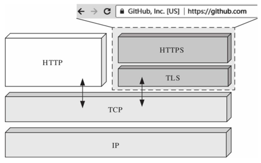
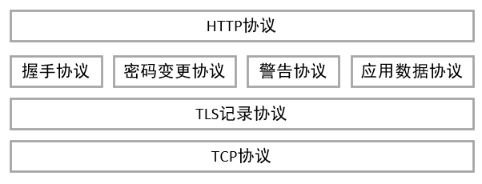

# SSL/TLS

SSL/TLS是应用最广泛的密码通信方法。SSL/TLS一种为计算机网络提供通信安全的加密协议，即扮演着将各种密码技术组合起来的“框架”角色。最常见就是互联网协议HTTPS，此外还有物联网方向的CoAPs，MQTTs等。



SSL(Secure Socket Layer)最初是网景公司设计的，一直迭代到SSL3.0协议版本。而TLS(Transport Layer Security)是IETF在SSL3.0基础上设计的，最新的TLS版本为[RFC8446](https://datatracker.ietf.org/doc/rfc8446/)规范发布的TLS1.3，本章主要以TLS1.3规范进行介绍。

TLS1.3是一种加密通信框架，包含了前面介绍的各种密码技术，包括密钥协商，对称加密，消息认证码，数字签名，数字证书等。

# TLS协议层

TLS协议是由TLS记录层协议（TLS record Protocol）和TLS握手协议（TLS handshake protocol）组成，向下位TCP传输协议之上，向上承接应用协议如HTTP。



## 记录层协议

TLS记录协议负责使用对称密码算法对消息进行加解密，包括4个子协议：握手协议，密码变更协议，警告协议，应用数据协议。记录层协议包括以下字段（摘自[RFC8446](https://datatracker.ietf.org/doc/rfc8446/)第5.1节）。

```c
enum {
	invalid(0),
	change_cipher_spec(20),
	alert(21),
	handshake(22),
	application_data(23),
	(255)
} ContentType;
struct {
	ContentType type;
	ProtocolVersion legacy_record_version;
	uint16 length;
	opaque fragment[TLSPlaintext.length];
} TLSPlaintext;
```

其中，

- type：记录层子协议类型，包括握手协议(22)，密码变更协议(20)，警告协议(21)，应用数据协议(23)。
- legacy_record_version：协议版本，向下兼容TLS1.2，如果协商成TLS1.3，必须为0x0303，即TLS1.2版本。
- length：负载数据长度，即下一字段TLSPlaintext.fragment的长度，不能超过2^14^字节。
- fragment：负载数据。

## 密码变更协议

密码变更协议负责通知对方进行密码变更，在TLS1.3版本已经被废弃，由消息```KeyUpdate```握手子协议进行替代。

## 警告协议

警告协议负责在通信异常时，将错误告知对方。警告协议具体结构如下（摘自[RFC8446](https://datatracker.ietf.org/doc/rfc8446/)第6节）。

```c
enum { warning(1), fatal(2), (255) } AlertLevel;
enum {
    close_notify(0),
    unexpected_message(10),
    bad_record_mac(20),
    record_overflow(22),
    handshake_failure(40),
    bad_certificate(42),
    unsupported_certificate(43),
    certificate_revoked(44),
    certificate_expired(45),
    certificate_unknown(46),
    illegal_parameter(47),
    unknown_ca(48),
    access_denied(49),
    decode_error(50),
    decrypt_error(51),
    protocol_version(70),
    insufficient_security(71),
    internal_error(80),
    inappropriate_fallback(86),
    user_canceled(90),
    missing_extension(109),
    unsupported_extension(110),
    unrecognized_name(112),
    bad_certificate_status_response(113),
    unknown_psk_identity(115),
    certificate_required(116),
    no_application_protocol(120),
    (255)
} AlertDescription;
struct {
    AlertLevel level;
    AlertDescription description;
} Alert;
```

其中，

- level：警告等级，分为警告和致命错误
- decription：警告描述

## 握手协议

握手协议在TLS协议中最为复杂，负责完成密码套件协商、共享密钥和身份认证等。握手协议具体结构如下（摘自[RFC8446](https://datatracker.ietf.org/doc/rfc8446/)第4节）。

```c
enum {
    client_hello(1),
    server_hello(2),
    new_session_ticket(4),
    end_of_early_data(5),
    encrypted_extensions(8),
    certificate(11),
    certificate_request(13),
    certificate_verify(15),
    finished(20),
    key_update(24),
    message_hash(254),
    (255)
} HandshakeType;
struct {
    HandshakeType msg_type; /* handshake type */
    uint24 length; /* remaining bytes in message */
    select (Handshake.msg_type) {
        case client_hello: ClientHello;
        case server_hello: ServerHello;
        case end_of_early_data: EndOfEarlyData;
        case encrypted_extensions: EncryptedExtensions;
        case certificate_request: CertificateRequest;
        case certificate: Certificate;
        case certificate_verify: CertificateVerify;
        case finished: Finished;
        case new_session_ticket: NewSessionTicket;
        case key_update: KeyUpdate;
    };
} Handshake;
```

其中，

- msg_type：消息类型，代表握手过程中包括ClientHello，ServerHello...等等

- length：长度，
- select：根据不同的消息类型，填充的消息数据

# 名称概念

## PSK

Pre-Shared Key，预制共享密钥，可以参考[RFC4279](https://datatracker.ietf.org/doc/rfc4279/)。

PSK包括：PSK Identity和PSK Key，两者相互对应，前者相当于用户名，后者相当于登录口令。

## 密码套件

# TLS1.3握手协议

TLS握手协议最为复杂，也最为精密，本节以基于TLS1.3的PSK密钥交换方式进行握手过程详述。