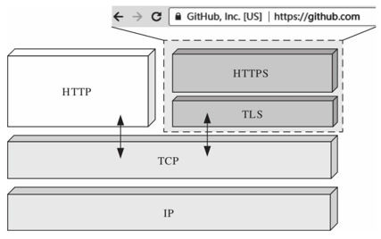
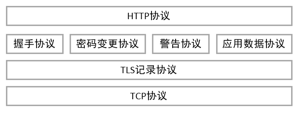
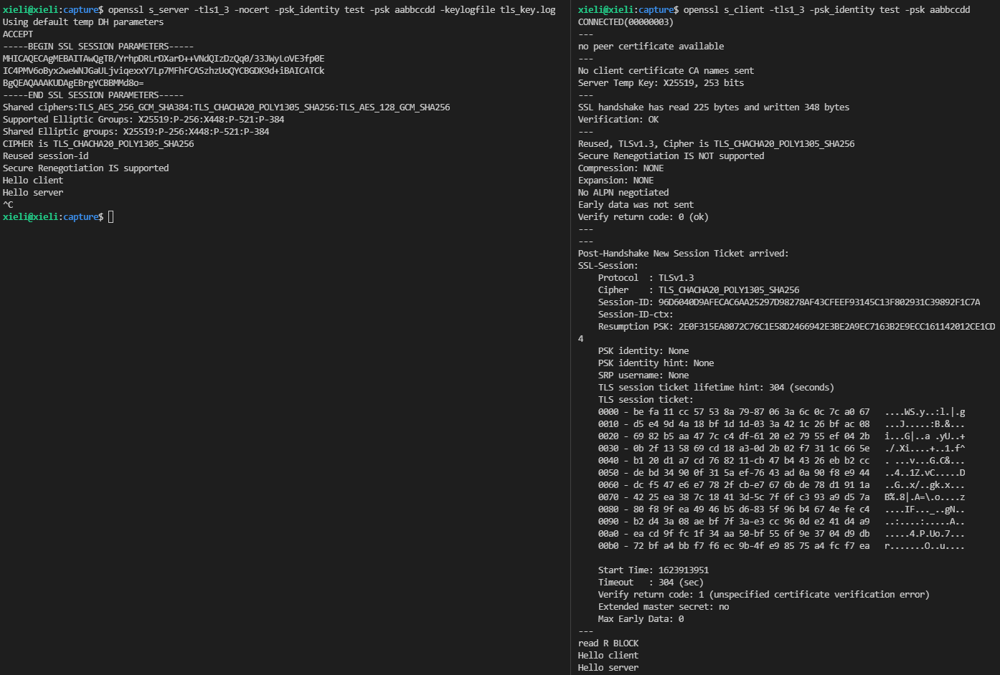
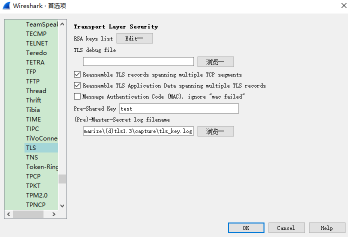
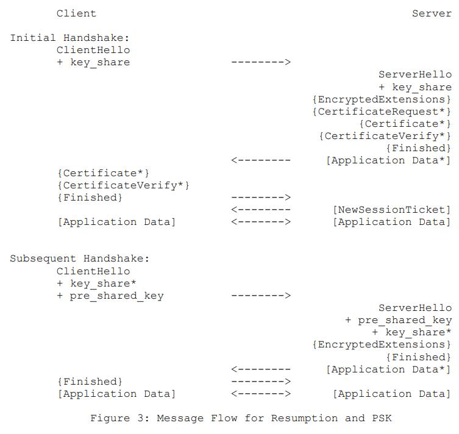
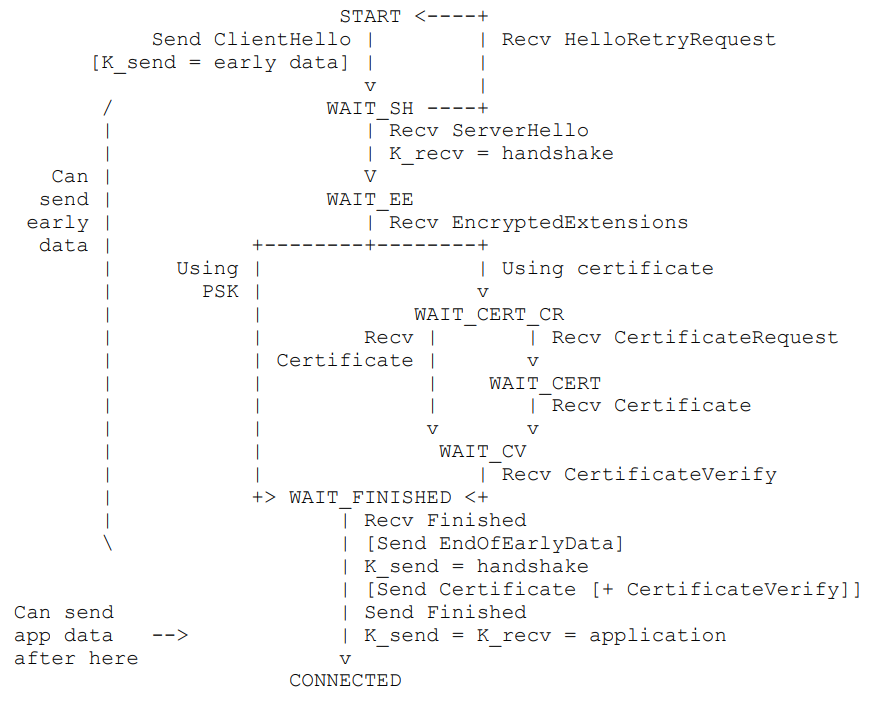
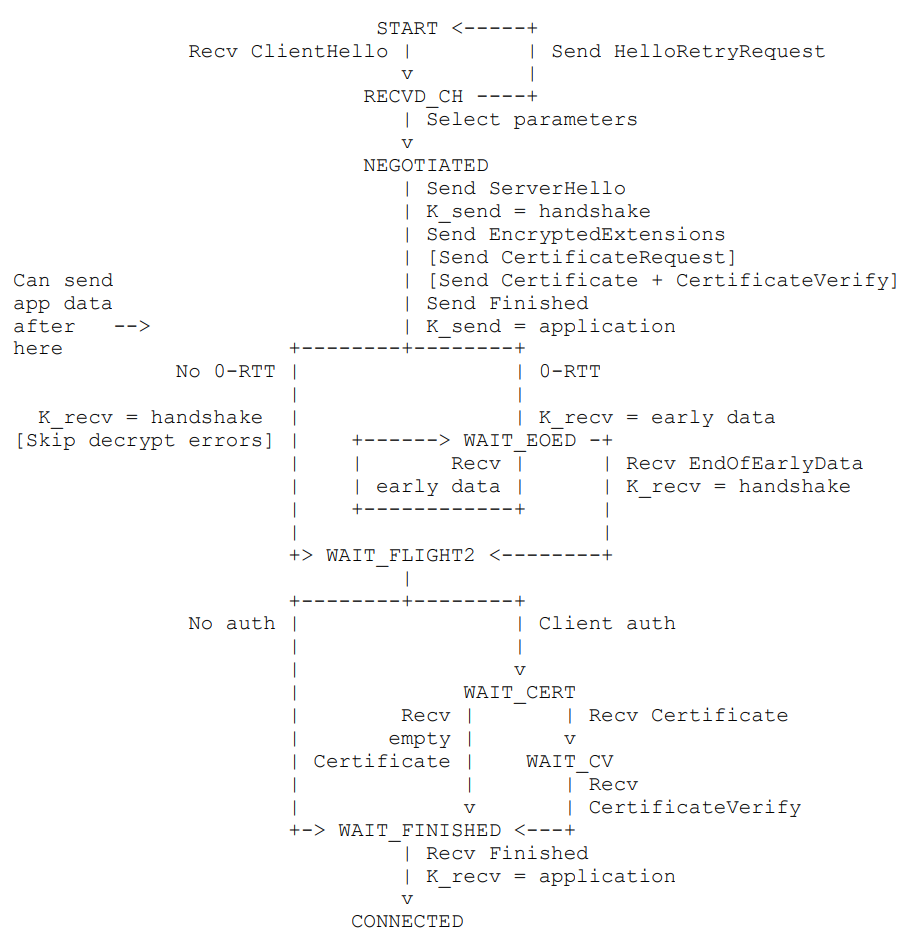

# SSL/TLS

SSL/TLS是应用最广泛的密码通信方法。SSL/TLS一种为计算机网络提供通信安全的加密协议，即扮演着将各种密码技术组合起来的“框架”角色。最常见就是互联网协议HTTPS，此外还有物联网方向的CoAPs，MQTTs等。



SSL(Secure Socket Layer)最初是网景公司设计的，一直迭代到SSL3.0协议版本。而TLS(Transport Layer Security)是IETF在SSL3.0基础上设计的，最新的TLS版本为[RFC8446](https://datatracker.ietf.org/doc/rfc8446/)规范发布的TLS1.3，本章主要以TLS1.3规范进行介绍。

TLS1.3是一种加密通信框架，包含了前面介绍的各种密码技术，包括密钥协商，对称加密，消息认证码，数字签名，数字证书等。

# TLS协议层

TLS协议是由TLS记录层协议（TLS record Protocol）和TLS握手协议（TLS handshake protocol）组成，向下位TCP传输协议之上，向上承接应用协议如HTTP。



## 记录层协议

TLS记录协议负责使用对称密码算法对消息进行加解密，包括4个子协议：握手协议，密码变更协议，警告协议，应用数据协议。记录层协议包括以下字段（摘自[RFC8446](https://datatracker.ietf.org/doc/rfc8446/)第5.1节）。

```c
enum {
	invalid(0),
	change_cipher_spec(20),
	alert(21),
	handshake(22),
	application_data(23),
	(255)
} ContentType;
struct {
	ContentType type;
	ProtocolVersion legacy_record_version;
	uint16 length;
	opaque fragment[TLSPlaintext.length];
} TLSPlaintext;
```

其中，

- type：记录层子协议类型，包括握手协议(22)，密码变更协议(20)，警告协议(21)，应用数据协议(23)。
- legacy_record_version：协议版本，除了ClientHello为了向下兼容，可以设置为0x0301，即TLS1.0版本，其他阶段必须为0x0303，即TLS1.2版本。
- length：负载数据长度，即下一字段TLSPlaintext.fragment的长度，不能超过2^14^字节。
- fragment：负载数据。

## 密码变更协议

密码变更协议负责通知对方进行密码变更，在TLS1.3版本已经被废弃，由消息```KeyUpdate```握手子协议进行替代。

## 警告协议

警告协议负责在通信异常时，将错误告知对方。警告协议具体结构如下（摘自[RFC8446](https://datatracker.ietf.org/doc/rfc8446/)第6节）。

```c
enum { warning(1), fatal(2), (255) } AlertLevel;
enum {
    close_notify(0),
    unexpected_message(10),
    bad_record_mac(20),
    record_overflow(22),
    handshake_failure(40),
    bad_certificate(42),
    unsupported_certificate(43),
    certificate_revoked(44),
    certificate_expired(45),
    certificate_unknown(46),
    illegal_parameter(47),
    unknown_ca(48),
    access_denied(49),
    decode_error(50),
    decrypt_error(51),
    protocol_version(70),
    insufficient_security(71),
    internal_error(80),
    inappropriate_fallback(86),
    user_canceled(90),
    missing_extension(109),
    unsupported_extension(110),
    unrecognized_name(112),
    bad_certificate_status_response(113),
    unknown_psk_identity(115),
    certificate_required(116),
    no_application_protocol(120),
    (255)
} AlertDescription;
struct {
    AlertLevel level;
    AlertDescription description;
} Alert;
```

其中，

- level：警告等级，分为警告和致命错误
- decription：警告描述

## 握手协议

握手协议在TLS协议中最为复杂，负责完成密码套件协商、共享密钥和身份认证等。握手协议具体结构如下（摘自[RFC8446](https://datatracker.ietf.org/doc/rfc8446/)第4节）。

```c
enum {
    client_hello(1),
    server_hello(2),
    new_session_ticket(4),
    end_of_early_data(5),
    encrypted_extensions(8),
    certificate(11),
    certificate_request(13),
    certificate_verify(15),
    finished(20),
    key_update(24),
    message_hash(254),
    (255)
} HandshakeType;
struct {
    HandshakeType msg_type; /* handshake type */
    uint24 length; /* remaining bytes in message */
    select (Handshake.msg_type) {
        case client_hello: ClientHello;
        case server_hello: ServerHello;
        case end_of_early_data: EndOfEarlyData;
        case encrypted_extensions: EncryptedExtensions;
        case certificate_request: CertificateRequest;
        case certificate: Certificate;
        case certificate_verify: CertificateVerify;
        case finished: Finished;
        case new_session_ticket: NewSessionTicket;
        case key_update: KeyUpdate;
    };
} Handshake;
```

其中，

- msg_type：消息类型，代表握手过程中包括ClientHello，ServerHello...等等

- length：长度
- select：根据不同的消息类型，填充的消息数据

# TLS1.3俗语

## PSK

Pre-Shared Key，预制共享密钥，可以参考[RFC4279](https://datatracker.ietf.org/doc/rfc4279/)。

PSK包括：PSK Identity和PSK Key，两者相互对应，前者相当于用户名，后者相当于登录口令。

## 密码套件

密码套件通常由对称加密算法，密钥协商算法，身份认证，哈希算法等组成，它约定了通信双方密码技术选择的“推荐套餐”，这样就可以像零件一样进行方便替换。以TLS1.3协议中```TLS_AES_128_GCM_SHA256```为例，

- 对称加密算法AES_128
- 消息认证码算法GCM
- 哈希算法SHA256

## TLS版本

TLS版本分别用不同的数据表示，目前有

- TLS1.3: 0x0304
- TLS1.2: 0x0303
- TLS1.1: 0x0302
- TLS1.0: 0x0301

## Transcript Hash

表单哈希，计算一系列握手消息（包括握手消息头，但是不包括记录层消息头）的哈希值。

# TLS1.3握手协议

TLS握手协议最为复杂，也最为精密，本节以基于TLS1.3的PSK密钥交换方式进行握手过程详述。

## OpenSSL TLS工具

OpenSSL的s_server和s_client是一个综合性的(D)TLS服务程序，可以快速进行TLS协议测试。

### s_server

启动服务端，参数为：协议版本*tls1_3*，不使用证书，psk identity为*test*，psk key为*aabbccdd*，打印ssl状态，调试模式，导出握手密钥，便于后面分析

```bash
openssl s_server -tls1_3 -nocert -psk_identity test -psk aabbccdd -state -debug -keylogfile tls_key.log
```

### s_client

启动客户端，参数为：协议版本*tls1_3*，psk identity为*test*，psk key为*aabbccdd*，打印ssl状态，调试模式

```bash
openssl s_client -tls1_3 -psk_identity test -psk aabbccdd -state -debug
```

### 示例

利用s_server和s_client模拟了TLS的握手过程，如下



在启动s_client服务前，利用wireshark工具抓包，网卡选择loopback。**注意由于TLS1.3协议在ChangeCipherSpec之后均为密文，为了解密这些消息，需要提前指定s_server导出的密钥文件**。



利用wireshark[抓包数据](capture/openssl_tls1.3_psk.pcapng)见下吗，我们着重关注TLS层，可以看出服务端和客户端握手包含多个阶段，接下来会对每一个过程进行详尽分析。


## TLS1.3握手过程分析

### ClientHello

客户端发起连接，发送ClientHello消息，消息由记录层头和记录层实体（握手协议）组成，包含TLS版本，随机数，密码套件，扩展等等。消息结构如下（摘自[RFC8446](https://datatracker.ietf.org/doc/rfc8446/)第4.1.2节）：

```c
uint16 ProtocolVersion;
    opaque Random[32];
    uint8 CipherSuite[2]; /* Cryptographic suite selector */
struct {
    ProtocolVersion legacy_version = 0x0303; /* TLS v1.2 */
    Random random;
    opaque legacy_session_id<0..32>;
    CipherSuite cipher_suites<2..2^16-2>;
    opaque legacy_compression_methods<1..2^8-1>;
    Extension extensions<8..2^16-1>;
} ClientHello;
```

wireshark抓包数据如下：

```tex
TLSv1.3 Record Layer: Handshake Protocol: Client Hello
    Content Type: Handshake (22)
    Version: TLS 1.0 (0x0301)
    Length: 279
    Handshake Protocol: Client Hello
        Handshake Type: Client Hello (1)
        Length: 275
        Version: TLS 1.2 (0x0303)
        Random: 33c551a725f28d04190a6ed5e4d0759bc8b02e9b6a51e67e965906b200781c0e
        Session ID Length: 32
        Session ID: c69f2191a0ab26e99a35dccb44c7d6b8f999a7f9861c0594fe5788027b24193c
        Cipher Suites Length: 8
        Cipher Suites (4 suites)
            Cipher Suite: TLS_AES_256_GCM_SHA384 (0x1302)
            Cipher Suite: TLS_CHACHA20_POLY1305_SHA256 (0x1303)
            Cipher Suite: TLS_AES_128_GCM_SHA256 (0x1301)
            Cipher Suite: TLS_EMPTY_RENEGOTIATION_INFO_SCSV (0x00ff)
        Compression Methods Length: 1
        Compression Methods (1 method)
            Compression Method: null (0)
        Extensions Length: 194
        Extension: server_name (len=14)
            Type: server_name (0)
            Length: 14
            Server Name Indication extension
                Server Name list length: 12
                Server Name Type: host_name (0)
                Server Name length: 9
                Server Name: localhost
        Extension: ec_point_formats (len=4)
        Extension: supported_groups (len=12)
            Type: supported_groups (10)
            Length: 12
            Supported Groups List Length: 10
            Supported Groups (5 groups)
                Supported Group: x25519 (0x001d)
                Supported Group: secp256r1 (0x0017)
                Supported Group: x448 (0x001e)
                Supported Group: secp521r1 (0x0019)
                Supported Group: secp384r1 (0x0018)
        Extension: session_ticket (len=0)
            Type: session_ticket (35)
            Length: 0
            Data (0 bytes)
        Extension: encrypt_then_mac (len=0)
        Extension: extended_master_secret (len=0)
        Extension: signature_algorithms (len=30)
            Type: signature_algorithms (13)
            Length: 30
            Signature Hash Algorithms Length: 28
            Signature Hash Algorithms (14 algorithms)
                Signature Algorithm: ecdsa_secp256r1_sha256 (0x0403)
                    Signature Hash Algorithm Hash: SHA256 (4)
                    Signature Hash Algorithm Signature: ECDSA (3)
                Signature Algorithm: ecdsa_secp384r1_sha384 (0x0503)
                Signature Algorithm: ecdsa_secp521r1_sha512 (0x0603)
                Signature Algorithm: ed25519 (0x0807)
                Signature Algorithm: ed448 (0x0808)
                Signature Algorithm: rsa_pss_pss_sha256 (0x0809)
                Signature Algorithm: rsa_pss_pss_sha384 (0x080a)
                Signature Algorithm: rsa_pss_pss_sha512 (0x080b)
                Signature Algorithm: rsa_pss_rsae_sha256 (0x0804)
                Signature Algorithm: rsa_pss_rsae_sha384 (0x0805)
                Signature Algorithm: rsa_pss_rsae_sha512 (0x0806)
                Signature Algorithm: rsa_pkcs1_sha256 (0x0401)
                Signature Algorithm: rsa_pkcs1_sha384 (0x0501)
                Signature Algorithm: rsa_pkcs1_sha512 (0x0601)
        Extension: supported_versions (len=3)
            Type: supported_versions (43)
            Length: 3
            Supported Versions length: 2
            Supported Version: TLS 1.3 (0x0304)
        Extension: psk_key_exchange_modes (len=2)
            Type: psk_key_exchange_modes (45)
            Length: 2
            PSK Key Exchange Modes Length: 1
            PSK Key Exchange Mode: PSK with (EC)DHE key establishment (psk_dhe_ke) (1)
        Extension: key_share (len=38)
            Type: key_share (51)
            Length: 38
            Key Share extension
                Client Key Share Length: 36
                Key Share Entry: Group: x25519, Key Exchange length: 32
                    Group: x25519 (29)
                    Key Exchange Length: 32
                    Key Exchange: 72fb9bbdfdb4ea2f20c2bd65c932ccf3709d1065a2ac1b7954d21d0883f6503b
        Extension: pre_shared_key (len=47)
            Type: pre_shared_key (41)
            Length: 47
            Pre-Shared Key extension
                Identities Length: 10
                PSK Identity (length: 4)
                    Identity Length: 4
                    Identity: 74657374
                    Obfuscated Ticket Age: 0
                PSK Binders length: 33
                PSK Binders
```

消息的组织格式为**T-L-V**，即**Tag-Length-Value**的样式。由于TLS1.3协议考虑了向下兼容，我们只需关注一下加粗的字段。

首先是记录层头：

- **Content Type**：记录层子协议类型，22代表握手
- **Version**：支持的版本最低为TLS1.0
- **Length**：后续数据长度

接着是握手协议消息：

- **Handshake Type**：1代表ClientHello
- **Length**：后续数据长度
- **Version**：必须设置为0x0303，兼容TLS1.2版本
- **Random**：随机数，32字节，前4字节为时间戳，后28字节为安全随机数
- Session ID：遗留字段，会话ID，TLS1.3以前的版本支持会话恢复，在TLS1.3已经用PSK替代，在兼容模式下，该字段必须非空。

- **Cipher Suites**：客户端支持的密码套件，TLS1.3协议约定了五种密码套件（摘自[RFC8446](https://datatracker.ietf.org/doc/rfc8446/)第B.4节）。

  ```TLS_AES_128_GCM_SHA256``` 、```TLS_AES_256_GCM_SHA384```、```TLS_CHACHA20_POLY1305_SHA256```、```TLS_AES_128_CCM_SHA256```、```TLS_AES_128_CCM_8_SHA256```

- Compression Methods：遗留字段，压缩模式

接下来是扩展字段：

- **扩展server_name**：客户端期望访问的虚拟主机名称

- 扩展ec_point_formats：TLS1.2版本字段，椭圆曲线坐标点类型，不用关注

- **扩展supported_groups**：客户端通知服务器自身支持的椭圆曲线列表，这里支持了五种曲线

  ```x25519```、```secp256r1```、```x448```、```secp521r1```、```secp284r1```

- **扩展session_ticket**：会话票证，支持无状态会话恢复，首次握手该字段数据为0

- 扩展encrypt_then_mac：TLS1.2版本字段，先加密后认证的模式选择，不用关注
- 扩展extended_master_secret：TLS1.2版本字段，不用关注
- **扩展signature_algorithms**：签名算法，如ecdsa_secp256r1_sha256表示哈希算法为sha256，签名算法用ecdsa
- **扩展supported_versions**：支持的版本，必须设置为0x0304，即TLS1.3版本
- **扩展psk_key_exchange_modes**：psk密钥交换模式，TLS1.3支持3中密钥交换方式：(EC)DHE，PSK-only，PSK with (EC)DHE。这里采用了第三种psk_dhe_ke
- **扩展key_share**：客户端共享密钥，其实就是密钥协商交换的公钥，采用x25519曲线，公钥长度为32字节

- **扩展pre_shared_key**：预制共享密钥，可以有多个psk
  - **PSK Identity**：这里显示为```74657374```，其实就是我们启用OpenSSL测试时设置的```test```
  - **PSK Binder**：构建PSK与当前握手之间的绑定，1字节的长度，32字节的binder值，binder计算很复杂，后面单独来讲

### ServerHello

服务器收到客户端的ServerHello后，将会回复ServerHello消息，包括TLS版本，选择的密码套件，扩展等，消息结构如下（摘自[RFC8446](https://datatracker.ietf.org/doc/rfc8446/)第4.1.3节）：

```c
struct {
    ProtocolVersion legacy_version = 0x0303; /* TLS v1.2 */
    Random random;
    opaque legacy_session_id_echo<0..32>;
    CipherSuite cipher_suite;
    uint8 legacy_compression_method = 0;
    Extension extensions<6..2^16-1>;
} ServerHello；
```

wireshark抓包数据如下：

```tex
TLSv1.3 Record Layer: Handshake Protocol: Server Hello
    Content Type: Handshake (22)
    Version: TLS 1.2 (0x0303)
    Length: 128
    Handshake Protocol: Server Hello
        Handshake Type: Server Hello (2)
        Length: 124
        Version: TLS 1.2 (0x0303)
        Random: 009905d89a761db314e41ae79a69cf19c1c55963c08d51ddd94503840aa24775
        Session ID Length: 32
        Session ID: c69f2191a0ab26e99a35dccb44c7d6b8f999a7f9861c0594fe5788027b24193c
        Cipher Suite: TLS_CHACHA20_POLY1305_SHA256 (0x1303)
        Compression Method: null (0)
        Extensions Length: 52
        Extension: supported_versions (len=2)
            Type: supported_versions (43)
            Length: 2
            Supported Version: TLS 1.3 (0x0304)
        Extension: key_share (len=36)
            Type: key_share (51)
            Length: 36
            Key Share extension
                Key Share Entry: Group: x25519, Key Exchange length: 32
                    Group: x25519 (29)
                    Key Exchange Length: 32
                    Key Exchange: 38b8698fb774eb796dee005a5cb08e3cd4d36d2d854d06b0dcbac0836ac78b24
        Extension: pre_shared_key (len=2)
            Type: pre_shared_key (41)
            Length: 2
            Pre-Shared Key extension
                Selected Identity: 0
```

同样首先是记录层头：

- **Content Type**：记录层子协议类型，22代表握手
- **Version**：版本，必须为0x0303，即TLS1.2
- **Length**：后续数据长度

接着是握手协议消息：

- **Handshake Type**：2代表ServerHello
- **Length**：后续数据长度
- **Version**：必须设置为0x0303，兼容TLS1.2版本
- **Random**：随机数，32字节，前4字节为时间戳，后28字节为安全随机数
- Session ID：遗留字段，会话ID，TLS1.3以前的版本支持会话恢复，在TLS1.3已经用PSK替代，在兼容模式下，该字段必须非空。

- **Cipher Suites**：协商后服务端选择的密码套件，这里选择```TLS_CHACHA20_POLY1305_SHA256```套件

- Compression Methods：遗留字段，压缩模式

接下来是扩展字段：

- **扩展supported_versions**：支持的版本，必须设置为0x0304，即TLS1.3版本
- **扩展key_share**：服务端共享密钥，其实就是密钥协商交换的公钥，采用x25519曲线，公钥长度为32字节

- **扩展pre_shared_key**：预制共享密钥
  - **Selected Identity**：服务端选择的psk Identity索引，这里是0，即“test”这个psk identity

### ChangCipherSpec

服务端发送ChangeCipherSpec消息，告知客户端，之后的消息将会加密传输，TLS1.3为了保持兼容，保留该类型握手消息。

wireshark抓包数据如下：

```tex
TLSv1.3 Record Layer: Change Cipher Spec Protocol: Change Cipher Spec
    Content Type: Change Cipher Spec (20)
    Version: TLS 1.2 (0x0303)
    Length: 1
    Change Cipher Spec Message
```

### EncryptedExtensions

服务端发送加密扩展，可以包含如supported_groups和server_name等扩展，消息结构如下（摘自[RFC8446](https://datatracker.ietf.org/doc/rfc8446/)第4.1.3节）：

```c
struct {
    Extension extensions<0..2^16-1>;
} EncryptedExtensions;
```

wireshark抓包数据如下：

```tex
TLSv1.3 Record Layer: Handshake Protocol: Encrypted Extensions
    Opaque Type: Application Data (23)
    Version: TLS 1.2 (0x0303)
    Length: 23
    [Content Type: Handshake (22)]
    Handshake Protocol: Encrypted Extensions
        Handshake Type: Encrypted Extensions (8)
        Length: 2
        Extensions Length: 0
```

同样首先是记录层头：

- **Opaque Type**：记录层子协议类型，23代表应用数据类型
- **Version**：版本，必须为0x0303，即TLS1.2
- **Length**：后续数据长度

接着是消息内容类型：

- **Content Type**：内容类型，22代表握手

接下来是握手协议内容：

- **Handshake Type**：8代表加密扩展
- **Length**：长度
- **Extensions Length**：扩展长度，这里加密扩展内容为空

### Finished

服务端发送Finished消息，表示握手过程到处结束，用于对握手过程及计算的密钥提供认证。消息结构如下（摘自[RFC8446](https://datatracker.ietf.org/doc/rfc8446/)第4.4.4节）：

```bash
struct {
    opaque verify_data[Hash.length];
} Finished;
```

验证的数据verify_data计算如下：

```tex
verify_data =
HMAC(finished_key, Transcript-Hash(Handshake Context, Certificate*, CertificateVerify*))
```

其中Transcript-Hash为表单哈希，计算所有握手消息的哈希值。然后用finished_key对该哈希值作HMAC计算，finished_key定义如下：

```tex
finished_key = HKDF-Expand-Label(BaseKey, "finished", "", Hash.length)
```

HKDF-Expand-Lablel是密钥派生函数，关于该函数以及握手阶段密钥如何生成的，后面单独来讲。

wireshark抓包数据如下：

```tex
TLSv1.3 Record Layer: Handshake Protocol: Finished
    Opaque Type: Application Data (23)
    Version: TLS 1.2 (0x0303)
    Length: 53
    [Content Type: Handshake (22)]
    Handshake Protocol: Finished
        Handshake Type: Finished (20)
        Length: 32
        Verify Data
```

同样首先是记录层头：

- **Opaque Type**：记录层子协议类型，23代表应用数据类型
- **Version**：版本，必须为0x0303，即TLS1.2
- **Length**：后续数据长度

接着是握消息内容类型：

- **Content Type**：内容类型，22代表握手

接下来是握手协议内容：

- **Handshake Type**：20代表Finished
- **Length**：长度
- **Verify Data**：验证的数据，32字节

### ChangeCipherSpec

客户端发送ChangeCipherSpec消息，该过程与服务端的ChangeCipherSpec过程相同。

### Finished

客户端发送Finished消息，同样该过程与服务端的Finished过程相同。

### NewSessionTicket

服务端发送NewSessionTicket会话票据消息，该消息属于Post-Handshake消息，允许客户端后续可以进行会话恢复，类似于HTTP的Cookie机制，关于会话恢复具体实现后面单独来讲。

会话票据消息的结构如下（摘自[RFC8446](https://datatracker.ietf.org/doc/rfc8446/)第4.6.1节）：

```c
struct {
    uint32 ticket_lifetime;
    uint32 ticket_age_add;
    opaque ticket_nonce<0..255>;
    opaque ticket<1..2^16-1>;
    Extension extensions<0..2^16-2>;
} NewSessionTicket;
```

wireshark抓包数据如下：

```tex
TLSv1.3 Record Layer: Handshake Protocol: New Session Ticket
    Opaque Type: Application Data (23)
    Version: TLS 1.2 (0x0303)
    Length: 234
    [Content Type: Handshake (22)]
    Handshake Protocol: New Session Ticket
        Handshake Type: New Session Ticket (4)
        Length: 213
        TLS Session Ticket
            Session Ticket Lifetime Hint: 304 seconds (5 minutes, 4 seconds)
            Session Ticket Age Add: 319584202
            Session Ticket Nonce Length: 8
            Session Ticket Nonce: 0000000000000000
            Session Ticket Length: 192
            Session Ticket: befa11cc57538a7987063a6c0c7ca067d5e49d4a18bf1d1d033a421c26bfac086982b5aa…
            Extensions Length: 0
```

同样首先是记录层头：

- **Opaque Type**：记录层子协议类型，23代表应用数据类型
- **Version**：版本，必须为0x0303，即TLS1.2
- **Length**：后续数据长度

接着是消息内容类型：

- **Content Type**：内容类型，22代表握手

接下来是握手协议内容：

- **Handshake Type**：4代表会话票据
- **Length**：长度
- **TLS Session Ticket**：会话票据内容
  - **Session Ticket Lifetime Hint**：ticket有效时间，此处为304秒
  - **Session Ticket Age Add**：随机生成的32位值，用于模糊ticket
  - **Session Ticket Nonce**：每个nonce值在此连接上发送的所有ticket值都要唯一
  - **Session Ticket**：ticket值，作为PSK Identity
  - **extensions**：ticket的扩展，目前唯一的扩展为early_data，表示可用于发送0-RTT数据的最大长度

### Application Data

完成以上握手过程后，服务和客户端已经各自拥有后续通信的所有安全参数。这里服务端发送一帧应用消息，wireshark抓包数据内容如下：

```tex
TLSv1.3 Record Layer: Application Data Protocol: http-over-tls
    Opaque Type: Application Data (23)
    Version: TLS 1.2 (0x0303)
    Length: 30
    [Content Type: Application Data (23)]
    Encrypted Application Data: 662840f60f0647a18b24dc30b9f341b2e478882771c11f2295122fd237c0
    [Application Data Protocol: http-over-tls]
```

同样首先是记录层头：

- **Opaque Type**：记录层子协议类型，23代表应用数据类型
- **Version**：版本，必须为0x0303，即TLS1.2
- **Length**：后续数据长度

接着是消息内容类型：

- **Content Type**：内容类型，23代表应用数据

接下来是加密的应用数据：

- **Encrypted Application Data**：这里使用主密钥进行加密了的，我们配置的密钥文件，在wireshark底部点击```Decrypted TLS```，可以看到明文数据

  ```c
  0000   48 65 6c 6c 6f 20 63 6c 69 65 6e 74 0a            Hello client.
  ```

  表示成字符串形式即为我们发送的“**Hello client**”。

### Application Data

同样，客户端也发送一帧应用消息，wireshark抓包数据内容如下：

```tex
TLSv1.3 Record Layer: Application Data Protocol: http-over-tls
    Opaque Type: Application Data (23)
    Version: TLS 1.2 (0x0303)
    Length: 30
    [Content Type: Application Data (23)]
    Encrypted Application Data: 03f69264d18e76641fdb9da85d9813f4a6aeecb51100c4b4d74fcb0c8634
    [Application Data Protocol: http-over-tls]
```

同样首先是记录层头：

- **Opaque Type**：记录层子协议类型，23代表应用数据类型
- **Version**：版本，必须为0x0303，即TLS1.2
- **Length**：后续数据长度

接着是消息内容类型：

- **Content Type**：内容类型，23代表应用数据

接下来是加密的应用数据：

- **Encrypted Application Data**：这里使用主密钥进行加密了的，我们配置的密钥文件，在wireshark底部点击```Decrypted TLS```，可以看到明文数据

  ```c
  0000   48 65 6c 6c 6f 20 73 65 72 76 65 72 0a            Hello server.
  ```

  表示成字符串形式即为我们发送的“**Hello server**”。

### Alert

我们用s_server和s_client模拟的最后手动杀掉了s_server服务端进程，客户端发现断开后，发送了该警告消息。

wireshark抓包数据如下：

```tex
TLSv1.3 Record Layer: Alert (Level: Warning, Description: Close Notify)
    Opaque Type: Application Data (23)
    Version: TLS 1.2 (0x0303)
    Length: 19
    [Content Type: Alert (21)]
    Alert Message
        Level: Warning (1)
        Description: Close Notify (0)
```

同样首先是记录层头：

- **Opaque Type**：记录层子协议类型，23代表应用数据类型
- **Version**：版本，必须为0x0303，即TLS1.2
- **Length**：后续数据长度

接着是警告消息：

- **Level**：等级为警告
- **Description**：Close Notify，结束通知

# PSK握手消息流

基于PSK方式的握手具体过程如下（摘自[RFC8446](https://datatracker.ietf.org/doc/rfc8446/)第2.2节）：



到目前我们只进行了Initial Handshake首次握手测试，图中Subsequent Handshake就是后面要讲的会话恢复功能。

# 状态机

服务端和客户端握手过程状态机如下（摘自[RFC8446](https://datatracker.ietf.org/doc/rfc8446/)第A.1和A.2节），由于目前没用证书方式，我们只需关注PSK方式的状态机。

## 客户端

1. 客户端处于**START**初始状态
2. 客户端发送**ClientHello**消息
3. 客户端进入等待**WAIT_SH**，等待服务端发送**ServerHello**消息
4. 客户端收到**ServerHello**消息后，进入等待**WAIT_EE**，等待服务端发送**EncryptedExtensions**消息
5. 由于使用PSK，客户端进入等待**WAIT_FINISHED**，等待服务端发送**Finished**消息
6. 客户端收到服务端**Finished**消息后，发送客户端的**Finished**消息
7. 至此，客户端与服务端握手成功，可以安全的发送应用数据了



## 服务端

1. 服务端处于**START**初始状态
2. 服务端收到客户端发送的**ClientHello**消息，选择适当的参数
3. 服务端发送**Severhello**，**EncryptedExtensions**，**Finished**等消息
4. 由于目前没有发送0-RTT数据，也没有对客户端进行认证，服务端直接进入**WAIT_FINISHED**
5. 服务端收到客户端**Finished**消息后，握手完成
6. 至此，客户端与服务端握手成功，可以安全的发送应用数据了




