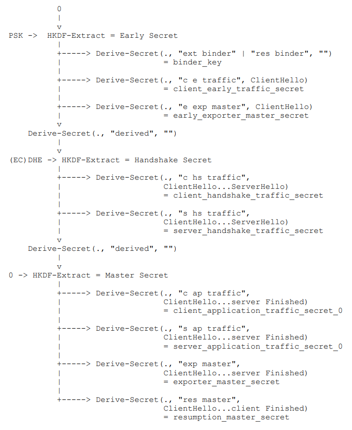

本节主要对TLS1.3协议中比较常见的概念知识进行深入分析。

# HKDF算法

密钥派生是将一个密钥生成一个或者多个密钥。在TLS1.2协议中使用的是伪随机数生成函数（PRF），该函数基于SHA256或更高强度的单向散列算法。而在TLS1.3协议中使用的是[RFC5869](https://datatracker.ietf.org/doc/rfc5869/)中定义的HKDF算法（HMAC-based Extract-and-Expand Key Derivation Function），其是基于HMAC的密钥派生方法。

HKDF计算分为两步：Extract和Expand，HKDF实现可参考[OpenSSL_HKDF](https://www.openssl.org/docs/man1.1.0/man3/EVP_PKEY_CTX_set_hkdf_md.html)。

## Extract

```tex
   HKDF-Extract(salt, IKM) -> PRK

   Options:
      Hash     a hash function; HashLen denotes the length of the
               hash function output in octets

   Inputs:
      salt     optional salt value (a non-secret random value);
               if not provided, it is set to a string of HashLen zeros.
      IKM      input keying material

   Output:
      PRK      a pseudorandom key (of HashLen octets)

   The output PRK is calculated as follows:

   PRK = HMAC-Hash(salt, IKM)
```

可以看出，HKDF的Extract操作就是HMAC计算。以HMAC-SHA256为例，输入参数为：salt盐，如未提供，就是默认设置32字节的全0；IKM，输入密钥材料。输出为32字节的伪随机密钥。

## Expand

```tex
   HKDF-Expand(PRK, info, L) -> OKM

   Options:
      Hash     a hash function; HashLen denotes the length of the
               hash function output in octets
   Inputs:
      PRK      a pseudorandom key of at least HashLen octets
               (usually, the output from the extract step)
      info     optional context and application specific information
               (can be a zero-length string)
      L        length of output keying material in octets
               (<= 255*HashLen)
   Output:
      OKM      output keying material (of L octets)

   The output OKM is calculated as follows:

   N = ceil(L/HashLen)
   T = T(1) | T(2) | T(3) | ... | T(N)
   OKM = first L octets of T

   where:
   T(0) = empty string (zero length)
   T(1) = HMAC-Hash(PRK, T(0) | info | 0x01)
   T(2) = HMAC-Hash(PRK, T(1) | info | 0x02)
   T(3) = HMAC-Hash(PRK, T(2) | info | 0x03)
   ...
```

可以看出，HKDF的Expand操作仍然是做HMAC计算。仍以HMAC-SHA256为例，输入参数为：PRK，至少为32字节的伪随机密钥，通常是Extract步骤的输出；info，可选的值，可以是""，L，期望的输出密钥材料长度（小于255*32字节）。输出参数为长度L字节的密钥材料。假定要Expand出48自己的密钥，计算步骤为：求轮数N=ceil(48/32)=2(+1取整)；T(0)=空，长度为0；T(1)=HMAC-SHA256(PRK, T(0) | info | 0x01)，第二个参数为T(0)，info，轮数0x01组合而成；T(2)=HMAC-SHA256(PRK, T(1) | info | 0x02)，第二个参数为T(0)，info，轮数0x02组合而成；OKM= T(1) | T(2)组合而成64字节的前48字节数据。

# 密钥计算

在TLS1.3握手阶段过程中，不同的秘密参数用于生成实际使用的密钥材料。由于握手过程中SeverHello和ClientHello都使用了随机数，因此每个traffic secrets均不相同。

## 密钥方案

TLS1.3的密钥派生过程充分利用HKDF算法。这里定义的两个计算操作：**HKDF-Extract**和**Derive-Secret**。HKDF-Extract就是上一部分HKDF算法中Extract步骤，而Derive-Secret定义如下（摘自[RFC8446](https://datatracker.ietf.org/doc/rfc8446/)的7.1节）：

```tex
Derive-Secret(Secret, Label, Messages) = 
HKDF-Expand-Label(Secret, Label, Transcript-Hash(Messages), Hash.length)
```

而HKDF-Expand-Label定义为：

````tex
HKDF-Expand-Label(Secret, Label, Context, Length) =
HKDF-Expand(Secret, HkdfLabel, Length)
````

其中HkdfLablel定义为：

```tex
struct {
    uint16 length = Length;
    opaque label<7..255> = "tls13 " + Label;
    opaque context<0..255> = Context;
} HkdfLabel;
```

因此最终定定义为：

```tex
Derive-Secret(Secret, Label, Messages) = HKDF-Expand(Secret, HkdfLabel, Hash.length)
HkdfLabel = Hash.length + Label.length + "tls13 " + Label + Hash.length + Transcript-Hash(Messages)
```

下图为TLS1.3握手过程中密钥派生方案图：


该图画的理解起来很困难，我们需要从横向和纵向进行单独分析，其中0表示输入HKDF-Extract的salt为全0字串。

从竖向来看：

1. 将**PSK**作为IKM，**0**作为salt输入**HKDF-Extract**函数得到输出**Early Secret**；
2. 将**Early Secret**作为Secret，**“derived”**作为Label，**“”**作为Messages输入**Derive-Secret**函数得到一个**临时密钥材料**1；
3. 将**(EC)DHE密钥协商出来的密钥**作为IKM，将**临时密钥材料**1作为salt输入**HKDF-Extract**函数得到输出**Handshake Secret**；
4. 同理，将**Handshake Secret**作为Secret，**“derived”**作为Label，**“”**作为Messages输入**Derive -Secret**函数得到又一个**临时密钥材料2**；
5. 同理，将**0**作为IKM，将**临时密钥材料2**作为salt输入**HKDF-Extract**函数得到输出**Master Secret**。

从横向来看：

1. 对于**Early Secret**，使用**Derive-Secret**函数可以得到不同的**secret**：**binder_key**，**client_early_traffic_secret** ，**early_exporter_master_secret** ；
2. 同理对于**Handshake Secret**，可以得到：**client_handshake_traffic_secret  **，**server_handshake_traffic_secret** ；
3. 同理对于**Master Secret**，可以得到：**client_application_traffic_secret_0** ，**server_application_traffic_secret_0** ，**exporter_master_secret** ，**resumption_master_secret** 。

其实输出的这些Secret并不是用作加密数据的密钥，可以理解为为了计算密钥Key而产生的临时变量。

## Traffic密钥计算

真正用于加解密用的密钥计算如下：

```tex
[sender]_write_key = HKDF-Expand-Label(Secret, "key", "", key_length)
[sender]_write_iv = HKDF-Expand-Label(Secret, "iv", "", iv_length)
```

其中sender表示发送方，即客户端或者服务端发送方向和接收方向使用不同的密钥，不同记录层的Secret值如下

```tex
+-------------------+---------------------------------------+
| Record Type 		| Secret 								|
+-------------------+---------------------------------------+
| 0-RTT Application | client_early_traffic_secret 			|
| Handshake 		| [sender]_handshake_traffic_secret 	|
| Application Data 	| [sender]_application_traffic_secret_N |
+-------------------+---------------------------------------+
```

# AEAD算法

AEAD（authenticated encryption with asociated data）即使用关联数据的认证加密算法，详见[RFC5116](https://datatracker.ietf.org/doc/rfc5116/)。TLS1.3协议强制使用AEAD算法来对记录层负载进行保护，常见为AES-CCM和AES-GCM算法。

TLS1.3用于AEAD操作的明文和密文结构如下（摘自[RFC8446](https://datatracker.ietf.org/doc/rfc8446/)的5.2节）：

```c
struct {
    opaque content[TLSPlaintext.length];
    ContentType type;
    uint8 zeros[length_of_padding];
} TLSInnerPlaintext;
struct {
    ContentType opaque_type = application_data; /* 23 */
    ProtocolVersion legacy_record_version = 0x0303; /* TLS v1.2 */
    uint16 length;
    opaque encrypted_record[TLSCiphertext.length];
} TLSCiphertext;
```


# 会话恢复

# 0-RTT

# 密钥更新

# Binder
