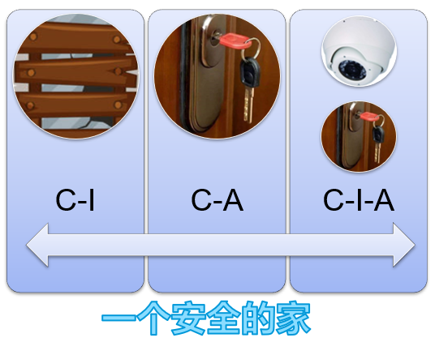
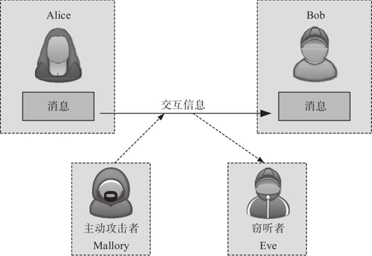
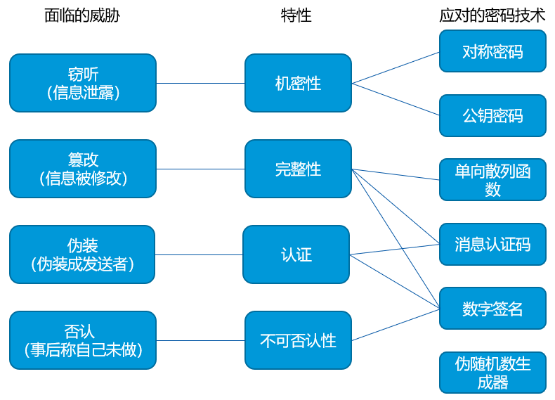

# 信息安全CIA

当今信息技术高速发展，信息安全越来越重要。信息安全是指保护完整可靠的数据仅能被授权访问，其包含三要素CIA：机密性（**C**onfidentiality）、完整性（**I**ntegrity）、可用性（**A**vailability）。

- 机密性：信息不为其他未授权的个人或团体获得

- 完整性：保证信息在传输、存储、使用的过程中，不被未经授权的修改

- 可用性：被授权访问信息的主体，在需要信息时能及时访问到

这里以举一个例子解释一下：比如要保护家里的资产（冰箱、洗衣机、电视等）。

- 左图将门窗封死，可以保证机密性：外人不能进入并知晓家里的状况；可以保证完整性，家里东西的不会被改变；无法保证可用性，自家人也不能进入。
- 中图给门上锁，可以保证机密性：外人不能进入并知晓家里的状况；无法保证完整性，家里东西被改变我无法知道；可以保证可用性，自家人可以进入。
- 右图在安锁的基础上再加装摄像头：可以保证机密性：外人不能进入并知晓家里的状况；可以保证完整性，家里东西的被改变了我可以知道；可以保证可用性，自家人可以进入。



# 密码学经典模型

密码学中有四个经典人物：通信方Alice，通信方Bob，主动攻击者Mallory，窃听者Eve。

假设学生Alice喜欢Bob，于是她写了一封信“我喜欢你”，想对Bob表白，如果Alice在不安全的通道中传递这封信，学生Eve截获并查看了这封信，可能就会向老师打小报告；更有甚者，学生Mallory，比如他喜欢Alice，可能就会篡改这封信，改成“我不喜欢你”，学生Bob收到这封被篡改的信后说不定就会伤心欲绝，一段浪漫的爱情故事就被扼杀了。



密码学提供了各种密码技术来保障Alice和Bob之间交换信息的安全：单向散列算法、对称加密算法、消息认证码、伪随机数生成器、公钥密码算法、数字签名算法等，其关系如下。



# 对称密码

对称加密算法是使用同一把密钥加密明文和解密密文的算法，保障数据的机密性。常见的对称加密算法有AES、DES和SM4等。

## 分组密码算法

对称密码算法一次只能处理固定长度的分组数据，需要进行分组和填充，分组密码模式有：

- ECB模式：将明文分组加密之后直接变成密文分组，已废弃

- CBC模式：首先将明文分组与前一个密文分组进行XOR运算，然后再进行加密，仅解密支持并行计算

- CFB模式：将明文分组与密码算法的输出进行XOR运算来生成密文分组，无需填充，仅解密支持并行计算

- OFB模式：密码算法的输出反馈到密码算法的输入中，无需填充，不支持并行计算

- CTR模式：通过对逐次累加的计数器进行加密来生成密钥流，然后与明文分组进行XOR运算得到密文分组，无需填充，支持并行计算

## AES算法

AES算法是一个对称分组加密算法，分组长度为16字节，密钥长度为128/192/256位。其内部实现操作包括字体替换、行移位、列混合、轮密钥加法。

## 实践测试

以AES128密钥长度分别测试ECB模式、CBC模式和CTR模式。其中输入消息为```hello.txt```，密文为```cipher.txt```，明文为```plain.txt```，密钥为```000102030405060708090A0B0C0D0E0F```。

### AES_ECB

1. 加密

   ```bash
   openssl enc -e -aes-128-ecb -in hello.txt -out cipher.txt -K 000102030405060708090A0B0C0D0E0F -p
   ```

   由于密文是二进制格式，可以用hexdump查看

   ```bash
   hexdump cipher.txt
   # 0000000 f8c3 4aa4 9091 1dd9 a8c7 e3e7 005f 2dcf
   # 0000010
   ```

2. 解密

   ```bash
   openssl enc -d -aes-128-ecb -in cipher.txt -out plain.txt -K 000102030405060708090A0B0C0D0E0F -p
   ```

3. 查看一致

   ```bash
   diff hello.txt plain.txt
   ```

### AES_CBC

1. 加密

   ```bash
   openssl enc -e -aes-128-cbc -in hello.txt -out cipher.txt -K 000102030405060708090A0B0C0D0E0F -iv 00000000000000000000000000000000 -p
   ```

2. 解密

   ```bash
   openssl enc -d -aes-128-cbc -in cipher.txt -out plain.txt -K 000102030405060708090A0B0C0D0E0F -iv 00000000000000000000000000000000 -p
   ```

3. 查看一致

   ```bash
   diff hello.txt plain.txt
   ```

### AES_CTR

1. 加密

   ```bash
   openssl enc -e -aes-128-ctr -in hello.txt -out cipher.txt -K 000102030405060708090A0B0C0D0E0F -iv 00000000000000000000000000000000 -p
   ```

2. 解密

   ```bash
   openssl enc -d -aes-128-ctr -in cipher.txt -out plain.txt -K 000102030405060708090A0B0C0D0E0F -iv 00000000000000000000000000000000 -p
   ```

3. 查看一致

   ```bash
   diff hello.txt plain.txt
   ```

# 单向散列函数

单向散列函数，常称为哈希函数，为消息产生一个“指纹”，用来检测消息的完整性。常见的哈希算法有MD5、SHA2家族（SHA256/SHA384/SHA512）和SM3等。

单向散列函数具有以下性质：输入长度可变，输出长度固定；高效率，能够快速计算出哈希值；消息不同，散列值也不同；单向性，不能通过哈希值推算出消息。

### 应用场景

假定Alice要向Bob传送表白信，具体过程如下

1. Alice准备好表白信
2. Alice使用哈希函数对该信计算消息摘要
3. Alice将信和消息摘要一并发给Bob
4. Bob收到信后使用相同的哈希函数计算摘要值
5. Bob比对收到的消息摘要和计算的消息摘要是否一致，一致则说明信未被篡改

## 无法解决的问题

假设主动攻击者Mallory伪装成Alice，向Bob发送了另外一封信及其散列值，Bob只能通过哈希函数检查这封信的完整性，但是无法判断发送者的身份到底是不是Alice。也即单向散列函数能够辨别出“篡改”，但无法辨别出“伪装”。

当Bob确认这封信是否真的属于Alice时，仅靠完整性检测是不够的，还需要进行认证。用于认证的技术包括消息认证码和数字签名。

## 实践测试

输入消息为```hello.txt```。

### SHA256

```bash
openssl dgst -sha256 hello.txt
# SHA256(hello.txt)= 7509e5bda0c762d2bac7f90d758b5b2263fa01ccbc542ab5e3df163be08e6ca9
```

### SM3

```bash
openssl dgst -sm3 hello.txt
# SM3(hello.txt)= 80b737c798f5bb0d826a987b0289e110d2283bb13d124aba4ec183644a05bb65
```

# 消息认证码

消息认证码（Message Authentication Code）可以用来检测消息的完整性和真实性。消息认证码输入包括消息和共享密钥，输出为固定的数据，称为MAC值、Tag。消息认证码不同于哈希函数，哈希函数输入只有消息本身，而消息认证码还有一个发送方和接收方之间的共享密钥。

## 应用场景

假定Alice要向Bob传送表白信，具体过程如下

1. Alice和Bob事先通过安全的渠道共享密钥
2. Alice使用密钥对表白信计算消息认证码MAC
3. Alice将表白信和MAC值发送给Bob
4. Bob收到表白信后，使用相同的密钥对其计算MAC值
5. Bob对比接收到MAC值和计算的MAC值是否一致，一致则说明信来自Alice且未被篡改

### 消息认证码实现方法

### 哈希函数实现

使用哈希函数实现消息认证码算法，称为HMAC，如HMAC-SHA256。在HMAC算法中，共享密钥和消息都没有长度限制。

### 分组密码实现

使用分组密码CBC模式可以实现消息认证码算法，常见为CBC-MAC，和CMAC。

### 认证加密算法实现

认证加密是同时提供数据机密性和完整性的密码算法，目前应用十分广泛，TLS1.3的标准套件均是采用认证加密形式，常见为CCM和GCM算法。

## 无法解决的问题

### 对第三方证明

消息认证码需要在发送者Alice和接收者Bob之间共享同一个密钥，能够计算正确MAC不只Alice，接收者Bob也行。对第三方而言，Alice或者Bob无法证明是对方计算了MAC值，而不是自己。

### 防止否认

假设Bob收到了包含MAC的消息，它自己能判断该消息确实来自Alice，但是无法向第三方指正。Alice可以否认说“这条消息你Bob自己编的吧”、“说不定Bob你密钥泄露了”。利用数字签名可以实现防止否认。

## 实践测试

输入消息为```hello.txt```，密钥为```000102030405060708090A0B0C0D0E0F```。

### HMAC-SHA256

```bash
openssl dgst -hmac 0123456789 hello.txt
# HMAC-SHA256(hello.txt)= 9a508fb28de804326fa6981304aebe896acfb32293797b234a1a3fa0a332a75d
// 或者
openssl dgst -mac hmac -macopt hexkey:000102030405060708090A0B0C0D0E0F hello.txt
```

#### CMAC

CMAC使用全0分组作为初始向量

```bash
openssl dgst -mac cmac -macopt cipher:aes-128-cbc -macopt hexkey:000102030405060708090A0B0C0D0E0F hello.txt
# CMAC(hello.txt)= eff62406f7a1b40b36c1be979b16473f
```

### GCM/CCM

[enc程序不支持AEAD模式](https://www.openssl.org/docs/man1.1.1/man1/enc.html)

````bash
openssl enc -e -aes-128-gcm -in hello.txt -out cipher.txt -K 000102030405060708090A0B0C0D0E0F -iv 00000000000000000000000000000000 -p
# enc: AEAD ciphers not supported
````

# 伪随机数生成器

随机数是一组不能被预测的数字或比特序列。产生随机数的生成器分为真随机数生成器（TRNG）和伪随机数生成器（PRNG或DRBG）。

由于真随机数通常是从物理过程中生成，因此真随机数生成器生成速度较慢；而伪随机数是采用软件的方式生成，速度较快。在实际应用中，通常采用真随机数作为“种子”，通过伪随机数生成器生成随机数序列。

## 伪随机生成算法

### Hash_DRBG

使用哈希算法作为随机数生成器基础算法

### HMAC_DRBG

使用消息认证码作为随机数生成器基础算法

### CTR_DRBG

使用分组密码算法的计数器模式作为随机数生成器基础算法

## 实践测试

生成32字节的随机数

```bash
openssl rand -hex 32
# b119beadec9779b660da7c5efa88a4cc1505363735b22bffc1612531a29a0e55
```

# 公钥密码

在对称密码中，加解密的密钥是相同的，Alice如何将密钥安全地（不被外人知晓）发送给Bob就是**密钥配送**问题。解决密钥配送问题的方法常见有：

- 通过事先共享密钥来解决
- 通过密钥分配中心来解决
- 通过密钥协商来解决
- 通过公钥密码来解决

在公钥密码中，加密密钥和解密密钥是不同的，加密密钥是发送者加密时使用的，该密钥称为**公钥**（public key），而解密密钥则是接收者解密时使用的，该密钥称为**私钥**（private key）。公钥可以公开，而私钥必须保密，公钥和私钥是一一对应的，一对公钥和私钥称为**密钥对**。RSA算法是一种常用的公钥密码算法。

## 应用场景

1. Bob生成一对RSA密钥对，包含公钥和私钥
2. Bob将生成的公钥发送给Alice，私钥自己保管
3. Alice收到Bob的公钥后，用该密钥对**对称密钥**进行加密，并将密文发送给Bob
4. Bob收到Alice发送的密文后，使用自身的私钥对其进行解密，得到**对称密钥**
5. 此后Alice就可以使用对称密钥对表白信进行加密，即**对称密码**的方式

上述方式称为**混合密码系统**，将消息通过对称密码来加密，将加密消息的密钥通过公钥密码来加密。

## 无法解决的问题

### 中间人攻击

主动攻击者Mallory混入发送者Alice和接收者Bob之间，对Alice伪装成“Bob”，对Bob伪装成“Alice”。

在公钥密码算法中，由于接收者Bob需要发送公钥给Alice，Mallory可以截获到该公钥，并替换成自己的公钥。然后Mallory将自己的公钥发送给Alice，但是Alice并不知道自己收到的公钥已经不是Bob的，仍然用Mallory的公钥将对称密钥加密发送出去，由于Mallory有该公钥的私钥，因此可以解密出来对称密钥。接着Mallory用保存的Bob公钥加密该对称密钥发送给Bob，同样Bob可以解密出来对称密钥。这样Mallory由于拿到了Alice和Bob间的对称密钥，因此就可以窃听和篡改接下来他们间的通信内容。

要防御中间人攻击，需要确认收到的公钥是否真的属于Bob，采用**认证**这种手段来保证，在这种情况下可以使用公钥的**证书**。

## 实践测试

### 生成RSA密钥

```bash
openssl genrsa -out pri_key.pem 1024
# 打印私钥
openssl rsa -in pri_key.pem -text
```

### 根据私钥生成公钥

```bash
openssl rsa -in pri_key.pem -out pub_key.pem -pubout
# 打印公钥
openssl rsa -pubin -in pub_key.pem -text
```

### 公钥加密

```bash
openssl rsautl -encrypt -pubin -inkey pub_key.pem -in hello.txt -out cipher.txt
```

### 私钥解密

```bash
openssl rsautl -decrypt -inkey pri_key.pem -in cipher.txt -out plain.txt
```

### 签名

如果用私钥进行加密，就是后面要讲的**签名**，用公钥解密就是**验签**。

```bash
openssl rsautl -inkey pri_key.pem -sign -in hello.txt -out signature.txt
```

### 验签

```bash
openssl rsautl -pubin -inkey pub_key.pem -verify -in signature.txt
```

# 密钥协商

密钥协商也可以解决上一节提出的密钥配送问题，即通过密钥协商可以得到双方通信的对称密钥。协商算法有DH（Diffie-Hellman）密钥协商和ECDH密钥协商，前者基于离散对数问题，后者基于椭圆曲线密码系统（ECC），由于ECDH密钥协商使用较短的密钥长度可提供与RSA或DH算法同级的安全等级，因此本节主要讲解ECDH密钥协商。

常见的椭圆曲线有secp256r1，secp384r1，secp521r1，x25519，x448等。

## 应用场景

ECDH密钥协商包含共享椭圆曲线参数和密钥协商。

### 共享参数

Alice和Bob在密钥协商前，需要达成一些共识。

1. 选择相同的椭圆曲线方程
2. 选择相同的大素数*p*
3. 选择相同的生成元*G(G~x~, G~y~)*

### 密钥协商

1. Alice生成一个随机数*d~A~*作为私密参数，可以理解为Alice的私钥
2. Alice计算*Q~A~=d~A~G=(x~A~, y~A~)*，并将*Q~A~*发送给Bob
3. Bob同样生成一个随机数*d~B~*作为私密参数，可以理解为Bob的私钥
4. Bob计算*Q~B~=d~B~G=(x~B~, y~B~)*，并将*Q~B~*发送给Alice
5. Alice收到*Q~B~*后，计算共享密钥*K~A~=d~A~Q~B~=d~A~(d~B~G)*
6. 同样Bob收到*Q~A~*后，计算共享密钥*K~B~=d~B~Q~A~=d~B~(d~A~G)*

根据椭圆曲线群符合群的结合律，可以得到*K~A~=K~B~=(x~Q~, y~Q~)*，共享密钥是一个坐标，实际使用时只取X坐标，假设椭圆曲线是secp256r1，其坐标长度为32字节。

## 无法解决的问题

同公钥密码算法类似，密钥协商也存在身份认证的问题，Alice和Bob双方无法确认获得的公钥是否真的来自对方，即会遭受中间人攻击。

## 实践测试

模拟Alice和Bob密钥协商的过程。

### 生成私钥A

```bash
openssl ecparam -out pri_key_a.pem -name prime256v1 -genkey
# 打印显示
openssl ec -in pri_key_a.pem -text -noout
```

### 提取公钥A

```bash
openssl ec -in pri_key_a.pem -pubout -out pub_key_a.pem
 # 打印显示
openssl ec -pubin -in pub_key_a.pem -text -noout
```

### 生成私钥B

```bash
openssl ecparam -out pri_key_b.pem -name prime256v1 -genkey
# 打印显示
openssl ec -in pri_key_b.pem -text -noout
```

### 提取公钥B

```bash
openssl ec -in pri_key_b.pem -pubout -out pub_key_b.pem
 # 打印显示
openssl ec -pubin -in pub_key_b.pem -text -noout
```

### 生成共享密钥

@TODO：在OpenSSL命令工具中未找到ECDH的命令

# 数字签名

数字签名类似现实世界中的盖章和签字，可以识别消息是否被篡改，并验证消息的可靠性，也可以**防止否认**。消息验证码中的密钥由双方共享，而数字签名私钥只有签名者私有，所以可以防止否认。

数字签名算法常见的有RSA算法，DSA算法和ECDSA算法，同样由于ECDSA基于ECC，密钥长度较短，本节主要讲解ECDSA签名算法。

## 应用场景

假定Alice要向Bob传送表白信，具体过程如下

1. Alice生成公私钥密钥对
2. Alice将公钥发送给Bob，私钥自己保留
3. Alice使用哈希函数对表白信计算摘要值
4. Alice使用私钥对消息摘要值进行签名
5. Alice将表白信和签名值一并发送给Bob
6. Bob收到表白信后，使用相同的哈希函数对其计算摘要值
7. Bob使用Alice的公钥对签名进行验签，若验证通过说明表白信来自Alice且未被篡改

可以看出，数字签名算法中，私钥只有Alice持有，其他人无法对签名进行伪造，这也使得Alice无法对这一过程进行否认。

## 实践测试

使用ECDSA签名算法，消息为```hello.txt```，对消息采用```sha256```求摘要值，再对摘要值进行签名。

### 生成私钥

```bash
openssl ecparam -out pri_key.pem -name prime256v1 -genkey
```

### 提取公钥

```bash
openssl ec -in pri_key.pem -pubout -out pub_key.pem
```

### 私钥签名

```bash
openssl dgst -sign pri_key.pem -sha256 -out signature.txt hello.txt
```

### 公钥验签

```bash
openssl dgst -verify pub_key.pem -sha256 -signature signature.txt hello.txt
# Verified OK
```

## 注意

- 实际使用中是对消息的摘要进行签名，而不是消息本身，因为数字签名本质还是公钥密码算法，即用私钥加密，公钥解密，如果消息太大，签名效率很低。

- 由于签名生成过程中，内部实现使用了随机数k，因此每次签名得到签名值均不相同，因此多次签名的签名值没有可比性，只能通过验签来判断签名值的正确性。

# 数字证书

前面解决密钥配送问题的方法：公钥密码算法，密钥协商，都会在不可信的路径中交换公钥，这会遭到中间人攻击，Alice本来想要获取的是Bob的公钥，实际得到的却可能是主动攻击者Mallory的公钥。有了证书，将身份确认的工作委托给了认证机构，可以降低遭到中间人攻击的风险。

证书和驾照类似，记有姓名、组织、邮箱、地址等个人信息，以及属于此人的**公钥**。只要看到公钥证书，就可以判定**“公钥确实属于此人”**。

## 公钥基础设施PKI

公钥基础设施（Public-Key Infrast）是为了有效运用公钥而制定的一些列规范和规格的总称。PKI的组成要素有：

- **用户**—使用PKI的人
- **认证机构**—颁发证书的人
- **仓库**—保存证书的数据库

## 应用场景

- Bob生成密钥对，密钥对包括Bob公钥和私钥
- Bob使用公钥生成证书签名请求（CSR），并将其发送给证书认证机构（CA） 
- 证书认证机构CA根据Bob的证书签名请求生成Bob证书， 证书中主要包含Bob的公钥和CA的数字签名
-  Bob将证书发送给Alice
- Alice从CA获取根证书， 并使用CA证书中的CA公钥对Bob证书中CA的签名进行验证， 从而判断Bob证书的真实性
-  验证通过后， Alice从Bob的证书中提取Bob公钥
-  Alice使用Bob的公钥将明文加密并发送至Bob
-  Bob收到密文后使用私钥解密得到明文。

CA认证机构，CA证书是一份“自签发”证书既充当Alice和Bob的“裁判”，也当了自己的“裁判”。因此数字证书结构的私钥保密性十分重要。

## 实践测试

证书签发过程选择的密钥对类型为椭圆曲线secp256r1，哈希算法为SHA-256，签名算法为ECDSA

### 生成CA根证书

生成CA私钥

```bash
openssl ecparam -out ca_key.pem -name prime256v1 -genkey
```

生成证书签名请求

```bash
openssl req -new -key ca_key.pem -out ca.csr
# 解析证书签名请求
openssl req -noout -in ca.csr -text
```

生成自签名根证书

```bash
openssl x509 -req -days 3650 -sha256 -signkey ca_key.pem -in ca.csr -out ca.crt
# 解析证书
openssl x509 -noout -in ca.crt -text
```

### 生成服务器证书

生成服务器私钥

```bash
openssl ecparam -out server_key.pem -name prime256v1 -genkey
```

生成证书签名请求

```bash
openssl req -new -key server_key.pem -out server.csr
# 解析证书签名请求
openssl req -noout -in server.csr -text
```

服务器证书签发

```bash
openssl x509 -req -days 3650 -sha256 -CAkey ca_key.pem -CA ca.crt -CAcreateserial -in server.csr -out server.crt
# 解析证书
openssl x509 -noout -in server.crt -text
```

# 密码技术总结

到此，我们知道Alice要与Bob通信时，使用**对称密码算法**对通信数据进行加密保证机密性，使用消息认证码或者数字签名保证数据的完整性，使用对称密码算法存在对称密钥如何配送问题？可以采用**公钥密码算法**或者**密钥协商算法**来解决，但是由于这两种算法过程会交换公钥，又会存在**中间人攻击**问题？这可以采用**数字证书**解决，那么可能有人问数字证书是**认证机构CA**对公钥加上了数字签名，我为什么要相信认证机构呢？这就关系到“信任是如何产生的”这一本质性问题，类似于你为什么要相信银行，公安机关等？无论采用何种密码技术，都**不可能在完全不可信的状态下创造出信任关系**。

为了通信双方建立安全可靠的连接：

- 使用密钥协商算法得到对称密钥
- 使用对称加密算法保障机密性
- 使用消息认证码或者数字签名保障消息的完整性
- 使用数字签名算法防止否认
- 使用数字证书确认公钥的真实性

将上述密码技术结合起来，这就是后面要介绍的**TLS/SSL框架**。

